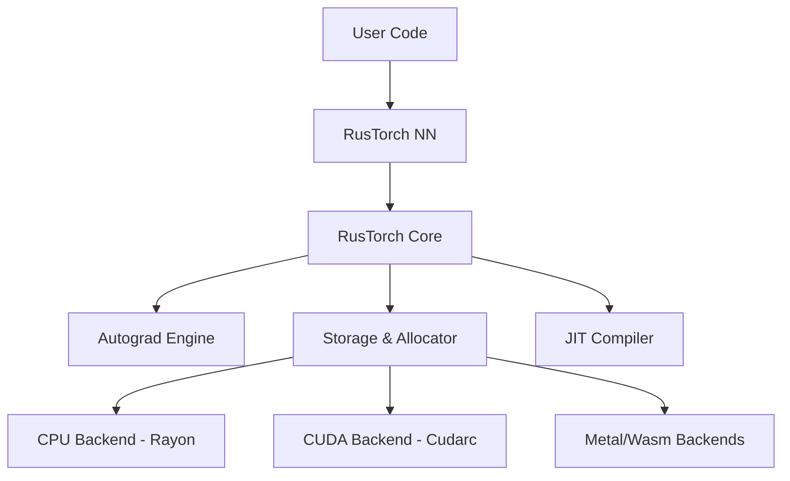

# RusTorch Architecture Guide 🏗️

RusTorch is designed as a modular, high-performance deep learning framework. This document outlines its core architectural components and design philosophy.

## High-Level Overview

RusTorch follows a layered architecture similar to PyTorch but leverages Rust's type system and ownership model for safety and concurrency.

---

## Core Components

### 1. `rustorch-core` (The Foundation)
This crate provides the `Tensor` struct, which is the central data structure.

*   **Tensor**: A wrapper around `Arc<TensorImpl>`. It provides a view into the underlying storage.
    *   **Shape & Strides**: Handles N-dimensional indexing and broadcasting.
    *   **Storage**: A contiguous memory block (Vec<f32> on CPU, CudaSlice on GPU).
    *   **Autograd**: Each tensor holds a `Mutex<Option<Tensor>>` for gradients and an `Option<Arc<dyn BackwardOp>>` for the computational graph.
*   **Autograd Engine**: Implements reverse-mode automatic differentiation. It builds a dynamic graph (DAG) during the forward pass. When `.backward()` is called, it traverses the graph in reverse topological order (currently recursive DFS) to compute gradients.
*   **JIT Compiler**: An experimental module (`jit.rs`) that captures the computation graph into an Intermediate Representation (IR). It performs static optimizations like:
    *   **Operator Fusion**: Combining `Conv2d` + `ReLU` into a single kernel to reduce memory bandwidth.
    *   **Dead Code Elimination**: Removing unused graph nodes.

### 2. `rustorch-nn` (The Neural Network Library)
Built on top of `core`, this crate defines the `Module` trait and implements common layers.

*   **Module Trait**: Defines the interface for all layers.
    *   `forward(&self, input: &Tensor) -> Tensor`
    *   `parameters(&self) -> Vec<Tensor>`
*   **Layers**:
    *   `Linear`, `Conv2d`: Standard learnable layers.
    *   `RNN`, `LSTM`, `GRU`: Recurrent layers with state management.
    *   `Transformer`: Multi-head attention and encoder blocks.
*   **Optimizers**: `SGD` and `Adam` implement parameter updates. They track parameter references and apply gradients.
*   **Data**: `Dataset` and `DataLoader` provide multi-threaded data pipeline primitives.

### 3. Backends & Acceleration

*   **CPU**: Uses `Rayon` for work-stealing parallelism. Operations like `matmul` and `conv2d` are parallelized across batch and channel dimensions.
*   **CUDA**: (In progress) Uses `cudarc` to manage GPU memory and launch PTX kernels. The architecture allows seamless switching between devices via the `Device` abstraction.

### 4. Distributed Training
*   **DistributedDataParallel (DDP)**: Implements data parallelism by replicating the model on multiple workers.
*   **AllReduce**: Gradients are synchronized across workers using a ring-reduction algorithm (currently simulated, extensible to MPI/NCCL).

---

## Design Principles

1.  **Safety First**: We use `Arc` and `Mutex` to manage shared state (like gradients) safely across threads. Rust's borrow checker prevents data races.
2.  **Zero-Cost Abstractions**: High-level APIs (like `Module`) compile down to efficient low-level code. We avoid overhead where possible.
3.  **Interoperability**: The API mirrors PyTorch to minimize the learning curve for Python users.
4.  **Extensibility**: The `BackwardOp` trait allows users to define custom differentiable operations easily.

---

## Future Roadmap

*   **Dynamic Graph Optimization**: enhancing the JIT to support dynamic control flow.
*   **XLA Integration**: Lowering the IR to XLA/HLO for broader hardware support (TPUs).
*   **Quantization**: Native support for int8 inference.
